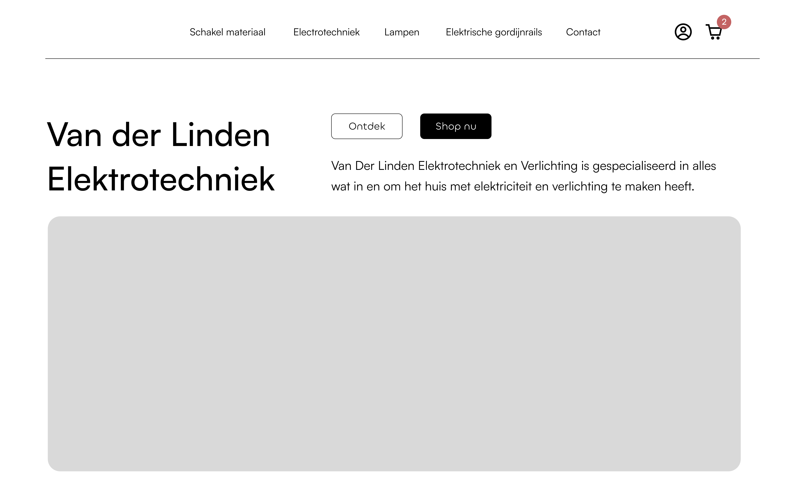

# Interactive Functionality

Ontwerp en maak voor een opdrachtgever een interactieve toepassing die voor iedereen toegankelijk is

De instructie vind je in: [INSTRUCTIONS.md](https://github.com/fdnd-task/the-web-is-for-everyone-interactive-functionality/blob/main/docs/INSTRUCTIONS.md)

## Inhoudsopgave

- [Beschrijving](#beschrijving)
- [Gebruik](#gebruik)
- [Kenmerken](#kenmerken)
- [Installatie](#installatie)
- [Bronnen](#bronnen)
- [Licentie](#licentie)

## Beschrijving

Ik maak een website voor <a href="https://www.vdle.nl/">VDLE</a>. Dit is een webshop met lampen als producten. De huidige website die nu live staat is vooral oud, en moet vernieuwd worden. Ik wil vooral de gebruiksvriendelijkheid, performance en SEO van de pagina verbeteren. <a href="https://the-web-is-for-everyone-interactive-tm72.onrender.com/">Render pagina</a>

## Gebruik

Als POST heb ik er voor gezorgd dat je producten[ aan het winkelwagentje kan toevoegen](https://github.com/JamieVos991/the-web-is-for-everyone-interactive-functionality/issues/3). Ik had een probleem dat ik een globale array gebruikte dus iedereen vanaf elke browser had dezelfde winkelwagen inhoud. Ik heb nu met [express-session](https://expressjs.com/en/resources/middleware/session.html), dat iedereen een eigen sessie heeft in de cookies.

## Kenmerken

### HTML

Ik heb mijn navigatie in de [head.liquid](https://github.com/JamieVos991/the-web-is-for-everyone-interactive-functionality/blob/main/views/partials/head.liquid) gezet, zodat dit herbruikt wordt op elke pagina in plaats van opnieuw de HTML strcutuur op elke pagina zetten. Een soort van component.

### CSS

Mijn naamgevingen in de [styleguide](https://github.com/JamieVos991/the-web-is-for-everyone-interactive-functionality/blob/main/public/stylesheets/stylesheet.css) zijn consistent en in dezelfde taal.

<!-- Bij Kenmerken staat welke technieken zijn gebruikt en hoe. Wat is de HTML structuur? Wat zijn de belangrijkste dingen in CSS? Wat is er met JS gedaan en hoe? Misschien heb je iets met NodeJS gedaan, of heb je een framework of library gebruikt? -->

## Installatie

<!-- Bij Installatie staat hoe een andere developer aan jouw repo kan werken -->

## Bronnen

## Licentie

This project is licensed under the terms of the [MIT license](./LICENSE).
